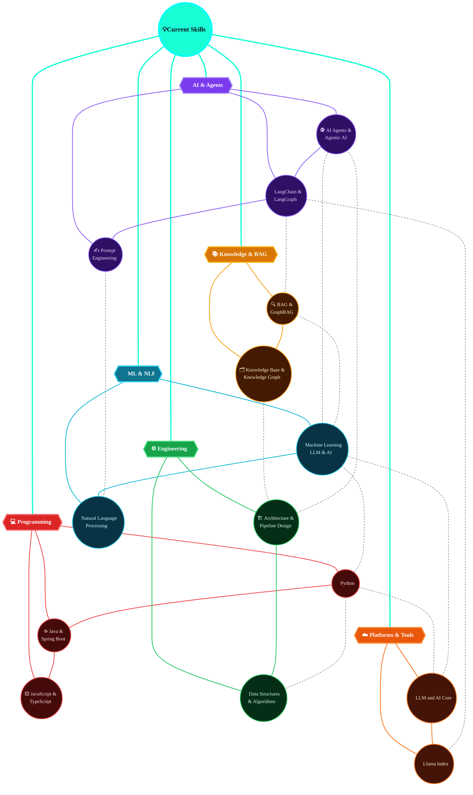

<h2 align="center" >Hi there ✨,I'm Uday Sharma </h2>
<h3 align="center"></h3>

### About Me 

- I'm an 🤖 ***Agentic AI Developer*** and 💻 ***Software Engineer***, passionate about building ***intelligent, autonomous systems*** that solve complex ***enterprise problems*** at scale. 🚀
- I Specialize in tackling ***enterprise-scale automation*** and ***decision-making challenges*** using ***multi-agent LLM systems*** 🧠. 
- I focus on overcoming limitations of traditional pipelines by designing ***scalable, stateful AI architectures*** (⚡ ***RAG & GraphRAG***) that enable efficient ***knowledge retrieval***, ***reasoning***, and ***workflow orchestration*** across ***distributed systems***. 🌐

 

<table>
<tr>
<td width="60" align="center">🚀</td>
<td>
**Building intelligent, autonomous systems** that solve complex enterprise problems at scale
</td>
</tr>
<tr>
<td width="60" align="center">🧠</td>
<td>
**Tackling enterprise-scale automation** with multi-agent LLM systems that go beyond traditional pipelines
</td>
</tr>
<tr>
<td width="60" align="center">🕵️</td>
<td>
**Building AI Agents & Agentic AI** — autonomous, goal-driven systems that plan, reason, and execute complex tasks end-to-end
</td>
</tr>
<tr>
<td width="60" align="center">⚡</td>
<td>
**Designing scalable AI architectures** — RAG, GraphRAG, stateful agents — for knowledge retrieval, reasoning & orchestration
</td>
</tr>
<tr>
<td width="60" align="center">🌐</td>
<td>
**Orchestrating workflows** across distributed systems with efficient, production-grade AI infrastructure
</td>
</tr>
</table>

### Ask me About

### 🌐 Socials:

 
     
 
 
 
  
    
    

### All Badges🎯
- ***@LeetCode***

</img>
</img>
</img>
</img>
</img>
</img>
</img>
</img>
</img>
</img>
</img>
</img>
</img>
</img>
</img>
</img>
</img>
</img>
</img>
</img>
</img>
</img>
</img>
</img>
</img>
</img>
</img>
</img>
</img>

###  My Stats

 

### 💻 Tech Stack:

  

  

  

  

  

### 📊 GitHub Stats:

 
  

  
  

### ❤ Views and Followers

